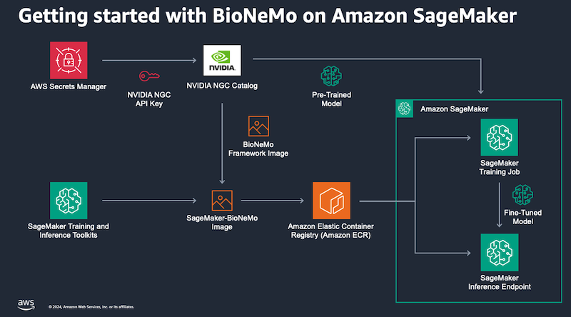

# Amazon SageMaker with NVIDIA BioNeMo

## Description

Code examples for running NVIDIA BioNeMo inference and training on Amazon SageMaker.

## Introduction

Proteins are complex biomolecules that carry out most of the essential functions in cells, from metabolism to cellular signaling and structure. A deep understanding of protein structure and function is critical for advancing fields like personalized medicine, biomanufacturing, and synthetic biology.

Recent advances in natural language processing (NLP) have enabled breakthroughs in computational biology through the development of protein language models (pLMs). Similar to how word tokens are the building blocks of sentences in NLP models, amino acids are the building blocks that make up protein sequences. When exposed to millions of protein sequences during training, pLMs develop attention patterns that represent the evolutionary relationships between amino acids. This learned representation of primary sequence can then be fine-tuned to predict protein properties and higher-order structure.

At re:Invent 2023, NVIDIA announced that its BioNeMo generative AI platform for drug discovery will now be available on AWS services including Amazon SageMaker, AWS ParallelCluster, and the upcoming NVIDIA DGX Cloud on AWS. BioNeMo provides pre-trained large language models, data loaders, and optimized training frameworks to help speed up target identification, protein structure prediction, and drug candidate screening in the drug discovery process. Researchers and developers at pharmaceutical and biotech companies that use AWS will be able to leverage BioNeMo and AWS's scalable GPU cloud computing capabilities to rapidly build and train generative AI models on biomolecular data. Several biotech companies and startups are already using BioNeMo for AI-accelerated drug discovery and this announcement will enable them to easily scale up resources as needed.

This repository contains example of how to use the [BioNeMo framework container](https://catalog.ngc.nvidia.com/orgs/nvidia/teams/clara/containers/bionemo-framework) on Amazon SageMaker.

## Architecture

## Setup

Before you create a BioNeMo training job, follow these steps to generate some NGC API credentials and store them in AWS Secrets Manager.

1. Sign-in or create a new account at NVIDIA [NGC](https://ngc.nvidia.com/signin).
2. Select your name in the top-right corner of the screen and then "Setup"

3. Select "Generate API Key".

4. Select the green "+ Generate API Key" button and confirm.

5. Copy the API key - this is the last time you can retrieve it!

6. Before you leave the NVIDIA NGC site, also take note of your organization ID listed under your name in the top-right corner of the screen. You'll need this, plus your API key, to download BioNeMo artifacts.

7. Navigate to the AWS Console and then to AWS Secrets Manager.

8. Select "Store a new secret".
9. Under "Secret type" select "Other type of secret"

10. Under "Key/value" pairs, add a key named "NGC_CLI_API_KEY" with a value of your NGC API key. Add another key named "NGC_CLI_ORG" with a value of your NGC organization. Select Next.

11. Under "Configure secret - Secret name and description", name your secret "NVIDIA_NGC_CREDS" and select Next. You'll use this secret name when submitting BioNeMo jobs to SageMaker.

12. Select the remaining default options to create your secret.

## Security

Amazon S3 now applies server-side encryption with Amazon S3 managed keys (SSE-S3) as the base level of encryption for every bucket in Amazon S3. However, for particularly sensitive data or models you may want to apply a different server- or client-side encrption method, [as described in the Amazon S3 documentation](https://docs.aws.amazon.com/AmazonS3/latest/userguide/UsingEncryption.html).

Additional security best practices, such as disabling access control lists (ACLs) and S3 Block Public Access, can by found in the [Amazon S3 documentation](https://docs.aws.amazon.com/AmazonS3/latest/userguide/security-best-practices.html).

See [CONTRIBUTING](CONTRIBUTING.md#security-issue-notifications) for more information.

## License

This library is licensed under the MIT-0 License. See the LICENSE file.
